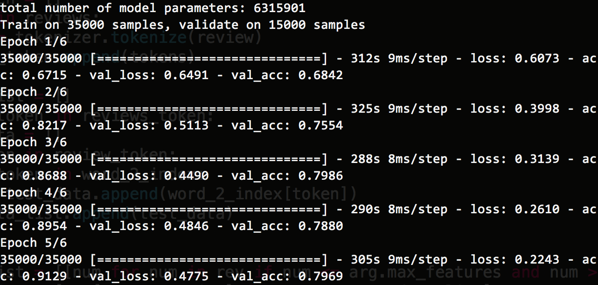

# Movie_success_prediction
'''This project is made using Twitter dev console and Aylien Text Api for getting factual data related to the movie entered by the user and we are gathering comments on the hashtags #moviename and categorizing the comments as positive, Negative, and neutral and Basis of that we are predicting the success of movie &amp; visualizing the same using pie charts.'''

  

  

### Steps to run the project :  

1. Clone this repo  
2. Install Flask framework in your system.  
3. Install the dependecies listed in requirement.txt file  
4. Run the server file using the command - python application.py  
5. Check the results on the browser by typing the movie name.  

### Made by Abhijeet and contributions by Adarsh 

#### Made for a demonstration of Twitter REST API calls and python library for plotting graphs on data retrieved !!! 
